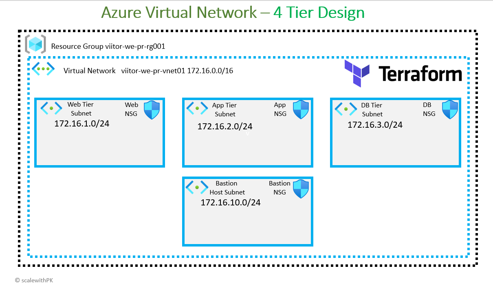

---
## Azure Virtual Network Design using Terraform
## description: Design 4-Tier Azure Virtual Network using Terraform
---
---
<span style="color:#5B2BBF;"><strong>Mentor:</strong></span> Praveen Kumar Gudla (PKsir)  
<span style="color:#5B2BBF;"><strong>Focus Areas:</strong></span> Azure | DevOps | Terraform | Cloud Engineering  
<span style="color:#5B2BBF;"><strong>Industry Experience:</strong></span> 17+ Years  

---

Connect:  
LinkedIn: https://www.linkedin.com/in/praveengudla  
GitHub: https://github.com/scalewithpk  

Learn Cloud the Industry Way — Not Just for Interviews

---


## Steps: Introduction


### Azure Virtual Network Design
- We are going to design the 4-Tier Azure Virtual Network here
1. Azure Virtual Network (viitor-we-pr-vnet01, 172.16.0.0/16)
2. WebTier Subnet + WebTier Network Security Group (Ports 80, 443)
3. AppTier Subnet + AppTier Network Security Group (Ports 8080, 80, 443)
4. DBTier Subnet + DBTier Network Security Group  (Ports 3306, 1433, 5432)
5. Bastion Subnet + Bastion Network Security Group (Ports 80, 3389)
6. Terraform `for_each` Meta-Argument 
### Azure Resources created
1. azurerm_resource_group
2. azurerm_virtual_network
3. azurerm_subnet
4. azurerm_network_security_group
5. azurerm_subnet_network_security_group_association
6. azurerm_network_security_rule

### Terraform Concepts covered
1. Terraform Settings Block
2. Terraform Provider Block
3. Terraform Input Variables
4. Terraform Local Values Block
5. Terraform Random Resource `random_string`
6. Terraform `for_each` Meta-Argument
7. Terraform `depends_on` Meta-Argument
8. Terraform Output Values

## Review all the Terraform configuration files


## Execute Terraform Commands
```t
# Terraform Initialize
terraform init

# Terraform Validate
terraform validate

# Terraform Plan
terraform plan

# Terraform Apply
terraform apply -auto-approve
```

## Verify Resources
```t
# Verify Resources - Virtual Network
1. Azure Resource Group
2. Azure Virtual Network
3. Azure Subnets (Web, App, DB, Bastion)
4. Azure Network Security Groups (Web, App, DB, Bastion)
5. View the topology
6. Verify Terraform Outputs in Terraform CLI
```

## Step: Delete Resources
```t
# Delete Resources
terraform destroy 
terraform apply -destroy

# Clean-Up Files
rm -rf .terraform* 
rm -rf terraform.tfstate*
```

<span style="color:#5B2BBF;">PKsir Message</span>

Real-world infrastructure is always designed in layers, not as isolated resources.

Understanding network tiers, security boundaries, and resource relationships is more important than just creating resources using Terraform.

When the design is clear, Terraform becomes a powerful tool to implement infrastructure in a consistent and repeatable way.

Always focus on designing infrastructure first, and then automate it using Infrastructure as Code.
