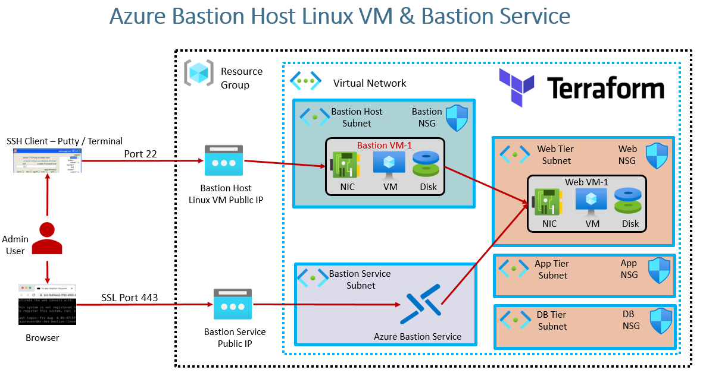

---
## Title: Azure Linux VM using Terraform
## Description: Create Azure Linux VM using Terraform
---
---
<strong>Mentor:</strong> Praveen Kumar Gudla (PKsir)  
<strong>Focus Areas:</strong> Azure | DevOps | Terraform | Cloud Engineering  
<strong>Industry Experience:</strong> 17+ Years  

---

Connect:  
LinkedIn: https://www.linkedin.com/in/praveengudla  
GitHub: https://github.com/scalewithpk  

Learn Cloud the Industry Way — Not Just for Interviews

---
## Step-00: Introduction

- We are going to create following Azure Resources
1. azurerm_public_ip
2. azurerm_network_interface
3. azurerm_network_security_group
4. azurerm_network_interface_security_group_association
5. Terraform Local Block for Security Rule Ports
6. Terraform `for_each` Meta-argument
7. azurerm_network_security_rule
8. Terraform Local Block for defining custom data to Azure Linux Virtual Machine
9. azurerm_linux_virtual_machine
10. Terraform Outputs for above listed Azured Resources 
11. Terraform Functions
- [file](https://www.terraform.io/docs/language/functions/file.html)
- [filebase64](https://www.terraform.io/docs/language/functions/filebase64.html)
- [base64encode](https://www.terraform.io/docs/language/functions/base64encode.html)